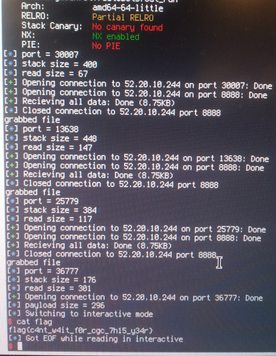

autobots - pwn350
-----------------

For pwn350 we're just provided with a port/IP combination. Quick inspection with nc revealed it was dumping what (at least initially) seemed to be an ELF 
binary down the pipe, then closing the socket. I disasassembled a few samples, mostly confirming this. The binaries seemed pretty straightforward:
Open a listening socket, recv a bunch of anything into a buffer, and quit. Looking at the differences between the samples, it was pretty noticeable that
the {port, buffer depth, read size} all changed randomly. 

Here are a few examples:

From main()'s prologue:

```assembly_x86
   0x000000000040077d <+0>:	push   rbp
   0x000000000040077e <+1>:	mov    rbp,rsp
   0x0000000000400781 <+4>:	sub    rsp,0x180
   0x0000000000400788 <+11>:	mov    edx,0x0
   0x000000000040078d <+16>:	mov    esi,0x1
   0x0000000000400792 <+21>:	mov    edi,0x2

```

```assembly_x86
   0x000000000040077d <+0>:	push   rbp
   0x000000000040077e <+1>:	mov    rbp,rsp
   0x0000000000400781 <+4>:	sub    rsp,0xf0
   0x0000000000400788 <+11>:	mov    edx,0x0
   0x000000000040078d <+16>:	mov    esi,0x1
   0x0000000000400792 <+21>:	mov    edi,0x2
```

From the network initialization:

```assembly_x86
   0x00000000004007d4 <+87>:	mov    edi,0x234b
   0x00000000004007d9 <+92>:	call   0x400600 <htons@plt>
```

```assembly_x86
   0x00000000004007d4 <+87>:	mov    edi,0x4b82
   0x00000000004007d9 <+92>:	call   0x400600 <htons@plt>
```

...And from the read() call:

```assembly_x86
   0x000000000040082e <+177>:	mov    edx,0x83
   0x0000000000400833 <+182>:	mov    rsi,rcx
   0x0000000000400836 <+185>:	mov    edi,eax
   0x0000000000400838 <+187>:	mov    eax,0x0
   0x000000000040083d <+192>:	call   0x400620 <read@plt>
```

```assembly_x86
   0x000000000040082e <+177>:	mov    edx,0x19b
   0x0000000000400833 <+182>:	mov    rsi,rcx
   0x0000000000400836 <+185>:	mov    edi,eax
   0x0000000000400838 <+187>:	mov    eax,0x0
   0x000000000040083d <+192>:	call   0x400620 <read@plt>
```

What should be obvious between these two (admittedly cherry-picked) samples is that one is exploitable...and the other simply isn't. At least not in any
reasonable method I found or used (hint: is the one which reads more than it allocates on the stack). 

At this point, I moved on to helping some teammates with the newly-functional pwn100/pwn200 in hopes of scoring a libc. Of course, I didn't actually
get around to copying it to my machine, so actually exploiting this didn't happen until the middle of Saturday (hoard your libcs, kids). For those playing
along at home - yes, redoing pwn100 would've probably saved a lot of time here, but I chose to just work on it locally. Plus, it was ~5am, 
efficiency wasn't at a high point.

Now, testing my initial hunch that the server was dumping the ELF and then running it was correct - I could even play around with overwrite lengths and 
find what seemed to be libc addresses, cool! Thinking I had to circumvent both ASLR and DEP, I set about testing attempting to leak relevant addresses
by calculating the saved RIP pointer's offset into the stack, overwriting it with an address higher in the executeable (no PIE, woo!) which resulted in
another series of ```read()```, ```write()``` calls. I planned to increment the overwrite *beyond* the pointer by a byte each time (yeah, could've done it by len(leak), 
but this ctf code). Once this was nearly working locally, I opened the challenge page again - "Note: Aslr has now been disabled for this challenge". 
Not sure if this was added, or I just can't read - regardless, this ended up being a lot simpler. Anyway - enough with that.

I wrote a quick bit of python to calculate the saved RIP overwrite depth, finally got a libc, and set about writing an incredibly simple ROP/ret2libc chain.
Testing it locally in strace worked beautifully...except where ```system()``` had no desire to listen on the socket's fd. Oops. Add a few jumps to ```dup2(3, *)```...Also nothing.
Change ```system()``` to a direct int 0x80/execve. Nothing. Change ```execve``` to libc exec{v, ve, p}. Nothing. I returned to my script, polished out a bug where it 
sometimes accepted a binary without enough space to store the ropchain, and repeated the above. 20 goto 10. 

If you've exploited binaries that don't redirect their own stdin/stdout over a socket, you may see what's wrong here. I'm not going to publically admit how
long it took me to figure this out, but eventually a teammate pointed out there was likely a script starting/managing these binaries, and that I should
maybe try a fd other than 3, and that 6 was a pretty reasonable starting guess. In hindsight, another solution is to start up a netcat instance through ```system()``` instead of bash.
Regardless, first run and it dropped a shell. Phew. Excuse the stupid picture:



Exploit script is every so slightly cleaned up and provided as pwn350-autobots-autopwn.py

Since you've read this far, here's the flag{c4nt_w4it_f0r_cgc_7h15_y34r} :)
