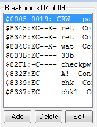

I've got a bit of a soft spot for odd/non-x86 challenges, so when I saw this


in the first RE challenge, I immediately picked it up.

The first order of business was to hunt down an IDA loader (one exists!), and I stumbled upon the excellent
[nesldr](https://github.com/patois/nesldr) by patois. Finding a good debugger/emulator took a bit longer, I went through a few unmemorable
choices before running into [fceux](http://www.fceux.com/web/home.html). Sweet, a Linux port! ...except, it doesn't have debugging support. Apparently
that's exclusive to the Windows version, something I failed to notice for an embarassingly long time. Eventually figuring this out, I loaded
up the ROM, and was greeted with...Something from Kung Fury? At this point we've got an ISA I haven't touched since freshman year in college, and 
we get to hack time - Can't stop now. For reference, I found a [few](http://www.thealmightyguru.com/Games/Hacking/Wiki/index.php?title=6502_Opcodes)
[sites](http://nesdev.com/6502.txt) [useful](https://kungfury.vhx.tv/updates/hackermans-time-hacking-tutorial) 
in reversing the 6502 disassembly, they may be helpful in following along. Enough introduction, [let's crack the thing.](https://www.youtube.com/watch?v=UEOLPDOKdtY)

Running through the ROM (turbo speed ftw), I ran into a fake "buffer overflow", which wasn't relevant at all. The fun begins when you need to find a 
password to unlock a time...lock...thing: 


I found the hash/auth routine by searching memory for my password (used a bunch of 0x41 per tradition during the CTF, it was easy to spot at addr 
0x005).

. 

A few read breakpoints later and I've got a good idea of what's going on. Breaking on the return and flipping the result stored in the A register
was tempting - and worked!

...Sort of:

. 

No flag for the easy route.

At this point, I just implemented a tiny subset of 6502 in python:

```python
def ROL_b(b):
  return ((int(b)<<1) | ((b&0x80)>>7)) & 0xFF

def ROR_b(b):
  return ((b>>1) | ((b&1) << 7)) & 0xFF

def ROR():
  global A
  A = ROR_b(A)

def ROL():
  global A
  A = ROL_b(A)

def TAX():
  global X
  X = A

def TXA():
  global X
  A = X

def PHA():
  global A
  stack.append(A)

def PLA():
  global A
  A = stack.pop()
```

I didn't really worry about simplifying anything, and just bruteforced the key (each byte was independent of the previous states, so this was very fast).
Points of note include extracting a few arrays of magic values used to validate the key, these were found by further runtime inspection/more breakpoints. 
The script is in this repo, along with some more images of the process. Here's the output:


The flag is NOHACK4UXWRATHOFKFUHRERX :)
